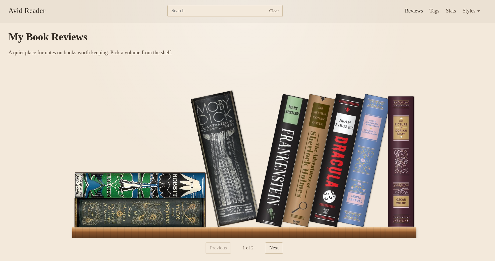

# Avid Reader

A minimal Hugo theme for book reviews. Reviews live in a `/reviews/` section and appear as spine-out volumes on a wooden shelf. Hover or focus a spine to pick the book up; click to read the review as a blog post.



Requires **Hugo 0.146.0** or later (new template system).

## Preview this repository

Demo content lives in `exampleSite/`. From the theme root, install Node dependencies once, then build the Pagefind index and serve:

```bash
npm install
npm run preview
```

That runs `hugo`, then `npx pagefind` into `exampleSite/static/pagefind` (so `hugo server` copies the index into `public/` instead of wiping it), then starts the server. Open the printed local URL.

Without npm scripts, from `exampleSite/`:

```bash
npx pagefind --site public --output-path static/pagefind
hugo server --themesDir ../..
```

Search is fuzzy and covers review pages only. `hugo server` alone will not have results until the index has been generated.

## Use it as a theme

Add the module to your site configuration:

```toml
[module]
  [[module.imports]]
    path = "github.com/mathscantor/hugo-theme-avid-reader"
```

Or clone it into `themes/hugo-theme-avid-reader` and set `theme = "hugo-theme-avid-reader"`.

## Search index

The header search bar is [Pagefind](https://pagefind.app/). It indexes review pages only. Hugo does not generate that index, so after every `hugo` build run Pagefind against `public/` and write the files into `static/pagefind`. The next Hugo run copies that folder into `public/pagefind`, which is what the search bar loads.

```bash
hugo
npx pagefind --site public --output-path static/pagefind
```

Add `static/pagefind/` to `.gitignore`. Do not commit the generated index.

If you skip the Pagefind step, the site still builds, but the search field stays empty.

Create reviews as leaf bundles so you can attach a cover image:

```bash
hugo new content reviews/the-hobbit/index.md
```

If the file is under `reviews/`, Hugo uses the `reviews` archetype.

## Review front matter

```yaml
---
title: "Pride and Prejudice"
date: 2026-09-01
draft: false
bookAuthor: "Jane Austen"
rating: 5
reread: "yes"
pages: 432
spinePosition: "vertical"
spineColor: "#3d2415"
spineImage: "spine.jpg"
coverImage: "cover.jpg"
tags: ["classics"]
---
```

| Field | Purpose |
| --- | --- |
| `title` | Book title; shown on the review page and as the spine tooltip |
| `bookAuthor` | Author of the book (not the site author) |
| `rating` | Number from 0 to 5; supports halves (for example `4.5`) |
| `reread` | Optional. `"yes"`, `"no"`, or `"maybe"` — whether the reviewer would reread the book for fun. Quote the value (`reread: "yes"`); unquoted `yes`/`no` are YAML booleans. Missing or unknown values count as `"no"` |
| `pages` | Optional. Wider spines for longer books |
| `spinePosition` | Optional shelf pose: `vertical` (default), `horizontal`, `lean-left`, or `lean-right`. Unknown values use `vertical` |
| `spineColor` | Optional hex color. If omitted, the theme picks a stable color from the title |
| `spineImage` | Optional page-bundle file (for example `spine.jpg`). When found, it is the spine background; `spineColor` is the fallback |
| `coverImage` | Optional page-bundle file (for example `cover.jpg`). Shown on the review page, not the shelf. If omitted, the theme looks for `cover.svg` |
| `tags` | Optional. Term pages reuse the bookshelf |

Put the cover file in the same bundle as `index.md`. The default name is `cover.svg`; set `coverImage` to use another filename. Put `spineImage` in that bundle as well. Example-site jackets are cached [Open Library](https://openlibrary.org/dev/docs/api/covers) covers from public editions.

`spineImage` is drawn with `cover` and centered, so any size works; the file is cropped to fill the spine. On screen the spine is **36–72px** wide (`pages / 8`) and about **243px** tall (`13.5rem`), or about **198px** on small screens. Use a tall, narrow image (about **1∶3.5 to 1∶7**):

| Use | Size |
| --- | --- |
| Matches the widest spine | **72 × 240** |
| Sharp on retina displays | **144 × 480** or **216 × 720** |

Keep the interesting part in the center. The left and right edges sit under a shading overlay. Do not put the review title on the image; the theme prints it on the review page and in the spine tooltip.

## Stats page

The theme can render a `/stats/` page with a genre pie chart, a would-reread pie chart, a reviews-over-time graph, a pages-read line graph, and a rating-distribution bar chart. All five charts filter in the browser by review `date`. The genre pie uses `tags`; reviews with no tags appear as Untagged. The reread pie uses `reread` (`"yes"`, `"maybe"`, `"no"`). The line chart uses the review `pages` field. The rating chart plots `rating` (0–5 in 0.5 steps) against book counts.

Create the page and add it to the menu:

```yaml
---
title: Stats
type: stats
---
```

```toml
[[menus.main]]
  name = "Stats"
  pageRef = "/stats"
  weight = 25
```

Save the page as `content/stats.md`. Time presets are past month, 3 months, 6 months, year, full duration, and a custom range.

## Shortcodes

### rating

```markdown


```

Renders an accessible star rating. A missing value fails the build.

### pullquote

```markdown

I declare after all there is no enjoyment like reading!

```

Renders a pull quote. Inner Markdown is processed. `attribution` is optional.

Hugo’s embedded shortcodes (`figure`, `youtube`, and others) work as usual.

## Add a site style

Each look is a stylesheet scoped to `html[data-style="{slug}"]`. Shared layout lives in `assets/css/main.css`; colors and atmosphere stay in `assets/css/style-{slug}.css`.

The first visit uses `params.defaultStyle` from the site config (`parchment` in `exampleSite/hugo.toml`). After that, a saved choice in `localStorage` (`avid-reader-style`) wins. An inline boot script in `layouts/_partials/head.html` applies it before first paint so the page does not flash the default.

Site owners set the first-visit default with `params.defaultStyle`. Visitors can still pick another look from the Styles menu; their saved choice overrides the default.

### Checklist

Use a lowercase slug such as `forest`.

1. **Add** `assets/css/style-{slug}.css`. Scope every rule under `html[data-style="{slug}"]`. Copy `assets/css/style-parchment.css` as the simpler starting point, or `assets/css/style-castle.css` if the look needs the alcove and gems. Set at least the tokens shared layout uses: `--ink`, `--ink-muted`, `--rule`, `--link`, `--gold`. Style or hide decorations the other looks use (`.shelf__alcove`, `.shelf__gem`, the review panel).

2. **Import** it from `assets/css/main.css`:

   ```css
   @import "style-forest.css";
   ```

   Leave shared geometry in `main.css`. Do not put colors there.

3. **Publish** the file at a stable path in `layouts/_partials/head.html` by adding `"css/style-{slug}.css"` to the existing `slice`. Hugo fingerprints `main.css`; `@import` needs the unhashed sibling name.

4. **Allowlist** `{slug}` in two places so unknown values are ignored: the boot script in `layouts/_partials/head.html`, and `setStyle` in `assets/js/style-switcher.js`.

5. **Expose it** in `exampleSite/hugo.toml` as a Styles child:

   ```toml
   [[menus.main]]
     name = "Forest"
     parent = "styles"
     params = { style = "forest" }
     weight = 30
   ```

   The menu template already turns `params.style` into a button. Site owners who consume the theme add the same menu entry (and optional `params.defaultStyle`) in their own config.

### Optional

- A new texture under `assets/` (same pattern as `--cobble-wall` in `head.html`).
- Extra markup in `layouts/_partials/shelf.html` only if CSS on the existing alcove and gems is not enough. Hide unused extras in the other style sheets.

Do not add a new JS switcher, a new menu partial, or review templates.

### Pull request checks

Confirm the home shelf, a review page, and `/tags` in the new style and in Castle and Parchment. Reload to confirm the choice persists. Check a narrow viewport. If the style adds motion, also check `prefers-reduced-motion`.

## License

MIT. See [LICENSE](LICENSE).
